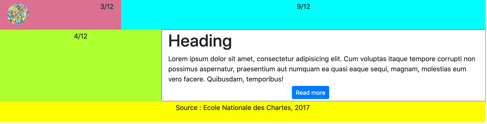
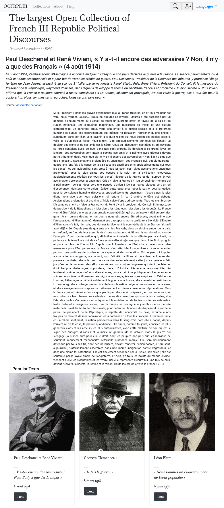

# Exercices-Framework-CSS
Exercices de CSS réalisés avec le framework Bootstrap dans le cadre du MTNAH

## Exercice 2 : 

- Comment placer le texte centré au milieu des colonnes ?
- Comment fixer le bouton "read more" sur la droite ? 

## Exercice 3 : 

- Comment rendre les boutons de la navbar plus transparent ? 
- Peut-on réduire la taille du texte et l'inclure dans une visionneuse avec une scroll bar ?
- Pour la partie "popular text" : comment uniformiser la taille des encarts ? (résolution image à harmoniser ?) et pourquoi dans les cards le boutton flag ne s'affiche pas ?

