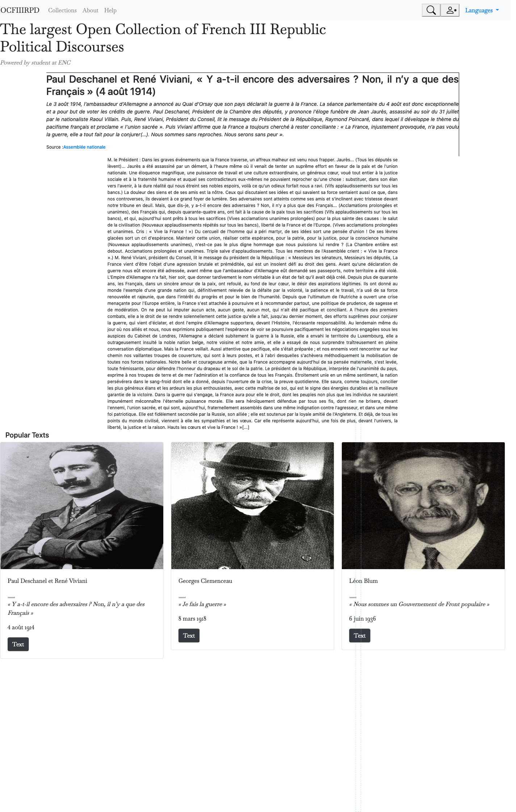

# Exercices-Framework-CSS
Exercices de CSS réalisés avec le framework Bootstrap dans le cadre du MTNAH

## Exercice 2 : 

- Comment placer le texte centré au milieu des colonnes ?
- Comment fixer le bouton "read more" sur la droite ? 

## Exercice 3 : 

- Comment rendre les boutons sur la droite de la navbar plus transparent (sans les bordures) ? 
- Lors du défillement de la page, comment faire en sorte que la navbar descende en même temps ?
- Peut-on réduire la taille du texte et l'inclure dans une visionneuse avec une scroll bar ?
- Pour la partie "popular text" : comment uniformiser la taille des encarts ? (résolution image à harmoniser ?) et pourquoi dans les cards le bouton "flag" ne s'affiche pas ?

## Exercice 4 : 

- Comment enlever l'espace entre les sous-titres en gris clair (ex. "The TSV should at least have the headers : lemma, POS, morph, form") et les boites d'input ?

